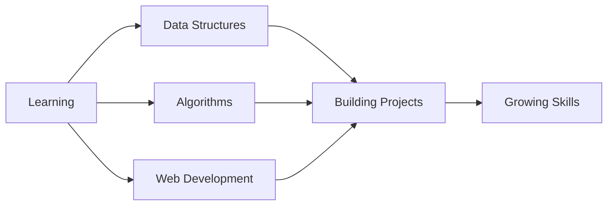

<div align="center">

# 👨‍💻 Hi, I'm Abhinav Sajeev

### Software Developer | Web Enthusiast | C & Python Learner

[](https://git.io/typing-svg)

[](https://www.linkedin.com/in/abhhiinv/)&nbsp;
[](mailto:abhinavsajeev2004@gmail.com)&nbsp;
[](https://github.com/abhhiinv)&nbsp;

</div>

---

## 🚀 About Me

```python
class Abhinav:
    def __init__(self):
        self.name = "Abhinav Sajeev"
        self.role = "Software Developer"
        self.location = "MACE Kothamangalam"
        self.routines = ["Problem Solving", "Web Development", "Algorithms"]
        self.hobbies = ["Gaming", "Music", "Movies"]
    
    def currently_learning(self):
        return ["Data Structures", "System Design", "Flask", "Python"]
```

---

## 🔭 What I'm Working On

- 🎓 **Academic Work** at MACE Labs:
  - 📚 Data Structures & Algorithms in **C**
  - 🐍 Python lab exercises and projects
  - 🌐 Web development assignments
  
- 💡 **Personal Projects**:
  - Built a simple web application using Flask
  - Micro-project using React
  - Strengthening algorithm knowledge

---

## 🛠️ Tech Stack

<div align="center">

### Languages
&nbsp;
&nbsp;
&nbsp;

### Web Technologies
&nbsp;
&nbsp;
&nbsp;

### Tools & Platforms
&nbsp;
&nbsp;
&nbsp;

</div>

---

## 📂 Featured Projects

<div align="center">

<a href="https://github.com/abhhiinv/MACE_Labs">
  &nbsp;
</a>

<a href="https://github.com/abhhiinv/flask_project">
  &nbsp;
</a>

<a href="https://github.com/abhhiinv/micro_project_webdev">
  &nbsp;
</a>

</div>

### 🎯 Project Highlights

| Project | Description | Tech Stack |
|---------|-------------|------------|
| **MACE_Labs** | University coursework: DSA in C, Python labs, and web development | C, Python, HTML/CSS |
| **flask_project** | Simple to-do list application built with Flask | Python, Flask |
| **micro_project_webdev** | Text sharing web application | HTML, CSS, JavaScript |

---

## 📊 GitHub Statistics

<div align="center">

&nbsp;


</div>

<div align="center">

&nbsp;


</div>

---
<!--
## 🏆 GitHub Trophies

<div align="center">

[](https://github.com/abhhiinv)

</div>

---

## 📈 Contribution Graph

<div align="center">


</div>

---
-->
## 💡 Profile Views & Stats

<div align="center">

&nbsp;
&nbsp;
&nbsp;

</div>

---

## 🎯 Current Focus



---

## 🤝 Let's Connect!

<div align="center">

I'm always open to interesting conversations and collaboration opportunities!

[](https://www.linkedin.com/in/abhhiinv/)&emsp;&emsp;
[](mailto:abhinavsajeev2004@gmail.com)

### ⚡ Fun Fact
*"Sometimes I have no idea about what I'm coding"* 😂

</div>

---

<div align="center">

### 💭 Quote of the Day


---

**Thanks for stopping by!** 😊

*If you like my work, consider leaving a ⭐ on my repositories!*

</div>
